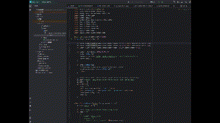

# rolich-dz1
Для запуска добавить в local.properties:
deepseek.api.key=you_api_key

Напишите минимальный код, который:
👉 отправляет запрос в LLM через API
👉 получает ответ
👉 выводит его в консоль или простой интерфейс (CLI / Web)

Результат:
Код, который отправляет запрос в LLM через API и получает ответ

